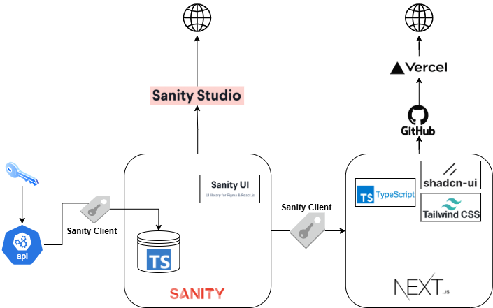
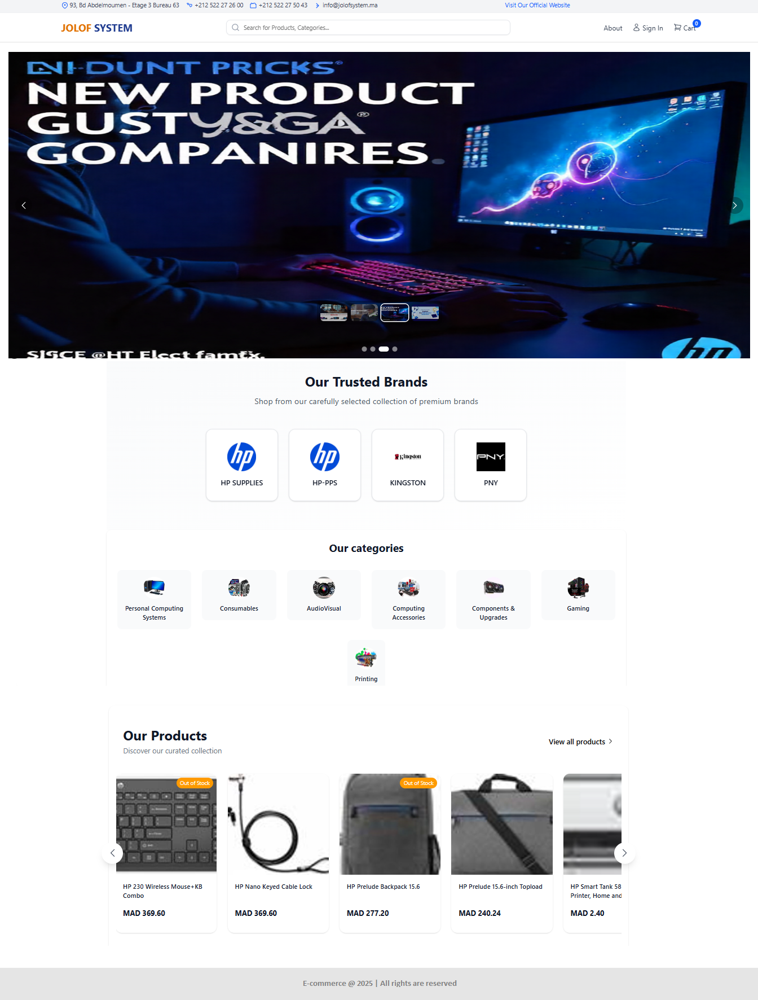

# ECOMMERCE-RESPONSIVE-WEBSITE

*Transform Shopping Into Seamless, Engaging Experiences*

*Built with the tools and technologies:*

 

## Table of Contents

- [ECOMMERCE-RESPONSIVE-WEBSITE](#ecommerce-responsive-website)
  - [Table of Contents](#table-of-contents)
  - [Overview](#overview)
  - [✨ Features](#-features)
    - [🛍️ Core E-commerce Functionality](#️-core-e-commerce-functionality)
    - [🔄 Automated Operations](#-automated-operations)
    - [⚡ Performance \& SEO](#-performance--seo)
  - [🛠️ Tech Stack](#️-tech-stack)
    - [Frontend](#frontend)
    - [Backend \& CMS](#backend--cms)
    - [Development Tools](#development-tools)
  - [🚀 Getting Started (Prerequisites)](#-getting-started-prerequisites)
  - [📸 Application Screenshots](#-application-screenshots)
  - [🙏 Acknowledgements](#-acknowledgements)

## Overview

**Ecommerce-Responsive-Website** is a cutting-edge full-stack e-commerce platform built with **Next.js 15** and **Sanity CMS**. This project combines a modern React-based frontend with a flexible, real-time content management system, providing a seamless shopping experience with robust backend capabilities.

The platform features automated product synchronization from external APIs, real-time inventory management, and a responsive design that works flawlessly across all devices.

## ✨ Features

### 🛍️ Core E-commerce Functionality
- **Product Catalog** with advanced filtering and search
- **Shopping Cart** with persistent storage
- **Checkout Process** with multiple payment options
- **Order Management** with real-time updates
- **User Authentication** with Clerk Auth

### 🔄 Automated Operations
- **API Synchronization** - Automated product data import from Logicom Partners API
- **Real-time Inventory** - Live stock level updates
- **Image Processing** - Automatic image optimization and CDN delivery
- **Content Management** - Sanity CMS integration for easy content updates

### ⚡ Performance & SEO
- **Server-Side Rendering** - Next.js SSR for optimal SEO
- **Image Optimization** - Next.js Image component with lazy loading
- **TypeScript** - Full type safety throughout the application
- **Responsive Design** - Tailwind CSS for mobile-first approach

## 🛠️ Tech Stack

### Frontend
- **Next.js 15** - React framework with App Router
- **TypeScript** - Type-safe development
- **Tailwind CSS** - Utility-first CSS framework
- **shadcn/ui** - Component library
- **Clerk** - User authentication

### Backend & CMS
- **Sanity CMS** - Headless content management
- **GROQ** - Query language for Sanity
- **Next.js API Routes** - Custom backend functionality

### Development Tools
- **ESLint** - Code linting
- **Prettier** - Code formatting
- **PostCSS** - CSS processing

## 🚀 Getting Started (Prerequisites)
- Node.js 18+
- npm or yarn
- Sanity.io account
- Clerk account for authentication

## 📸 Application Screenshots

- ### HomePage

- ### Product Listing Page

- ### Admin Dashboard Page

## 🙏 Acknowledgements
- Next.js Team - Amazing React framework
- Sanity.io - Powerful headless CMS
- Clerk - User authentication
- Tailwind CSS - Utility-first CSS framework
- shadcn/ui - Beautiful component library